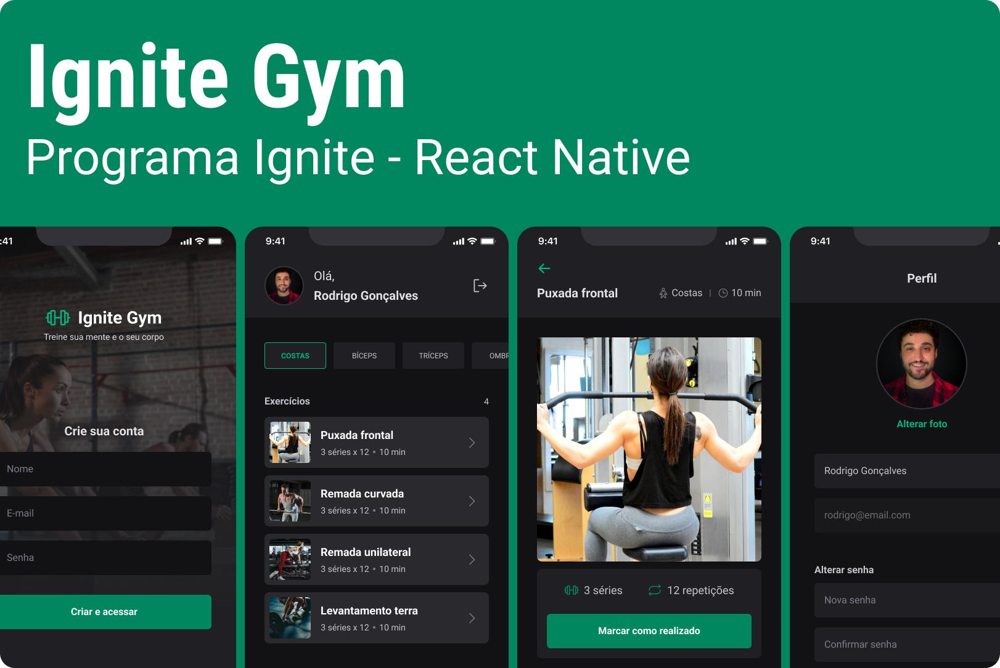

<p align="center">
  
</p>


<h1 align="center">
  Ignite Gym
</h1>
<p align="center">
  Gym App develop in Ignite Course by Rocketseat
</p>


## :hammer_and_wrench: Technologies used

- <a href="https://reactnative.dev/" target="_blank">React Native</a>
- <a href="https://docs.expo.dev/" target="_blank">Expo</a>
- <a href="https://nativebase.io/" target="_blank">Native Base</a>
- <a href="https://react-hook-form.com/" target="_blank">React Hook Form</a>
- <a href="https://github.com/jquense/yup" target="_blank">YUP</a>
- <a href="https://beta.reactjs.org/learn/passing-data-deeply-with-context" target="_blank">React Context API</a>
- <a href="https://axios-http.com/" target="_blank">Axios</a>

---

## :octocat: How to run

> You'll need to install:

- <a href="https://docs.expo.dev/get-started/installation/" target="_blank">Expo-CLI</a> in your computer
- <a href="https://expo.dev/client" target="_blank">Expo Go</a> in your mobile phone.

> **Clone the API repository** (developed by [Rodrigo Gonçalves](https://github.com/rodrigorgtic)):

```sh
git clone git@github.com:rodrigorgtic/ignitegym-api.git
```

Install dependencies:

```sh
npm install | npm i
```

Start development environment:

```sh
npm run start
```

> **Clone this repository:**

```sh
git clone git@github.com:edu2andrade/ignitegym.git
```

Install dependencies:

```sh
npm install | npm i
```

Start development environment:

```sh
npm run start
```

> Start Expo Go App in your device and connect the devices through QR Code. Devices must be in the same network.

---

## :alien: Author

Made with 🤘 by <a href="https://andradept.com/" target="_blank">Eduardo Andrade</a>